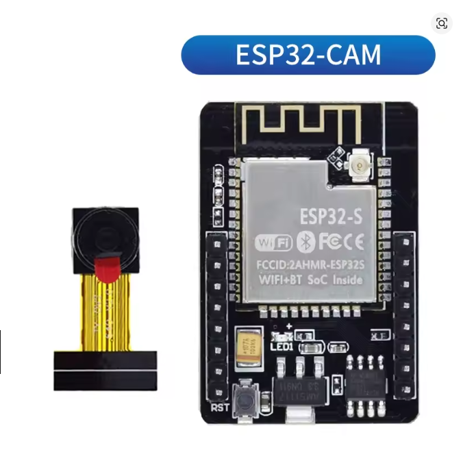
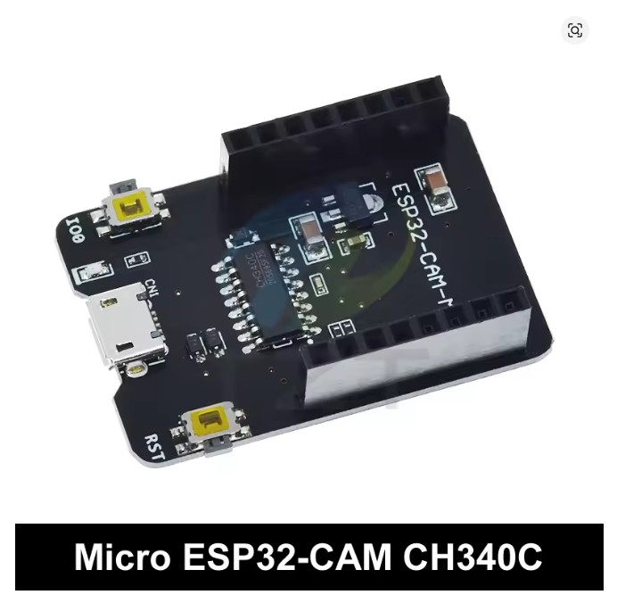
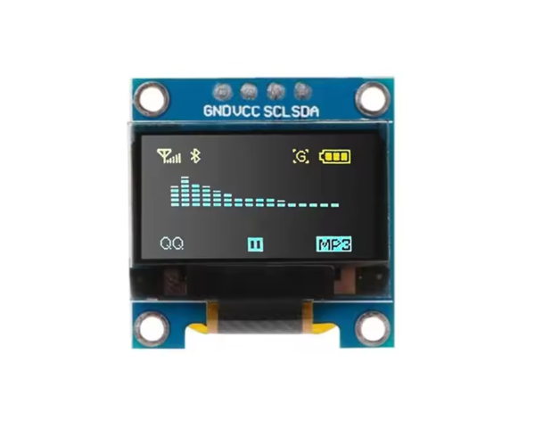
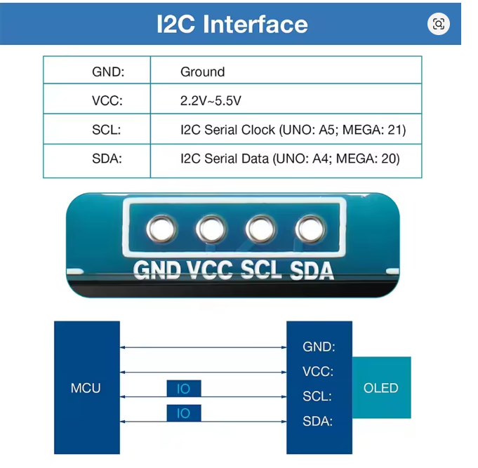
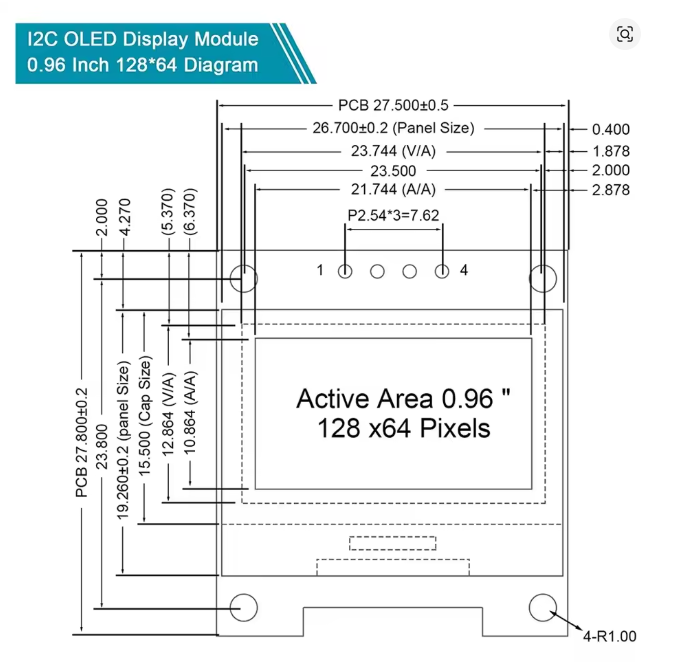
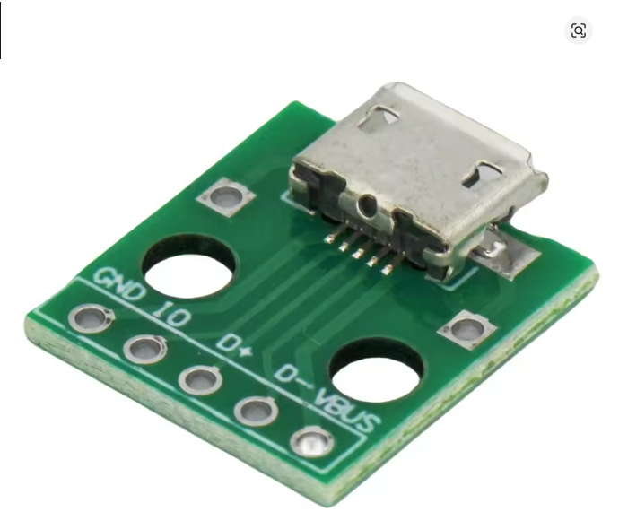

# ESP32-CAM Video Streaming with Web Control

Wireless video streaming system based on ESP32-CAM that creates an autonomous WiFi hotspot. Allows real-time streaming visualization through web browser and controls the flash LED with PWM intensity adjustment. Includes OLED display to show connection information without needing PC connection.

---

## 📸 Hardware Components Gallery

### Main Components

<p align="center">
  
  
</p>

### OLED Display SSD1306

<p align="center">
  
  
  
</p>

### USB Adapter

<p align="center">
  
</p>

---

## 🎯 Project Motivation

This project was created to provide a **simple home security camera** for monitoring young children from other rooms in the house. The system is designed to be accessible from any mobile device or PC connected to the same WiFi network, making it perfect for:

- **Baby monitoring** from another room
- **Child surveillance** while working from home
- **Quick setup** without complex network configurations
- **No cloud dependency** - everything works locally

The OLED display shows connection information in clear text (WiFi name, password, and IP address) intentionally, as anyone with physical access to the camera should be able to connect. This makes it easy for family members or caregivers to access the video stream without needing technical knowledge.

**Key advantages:**
- ✅ No internet connection required
- ✅ No monthly subscription fees
- ✅ No cloud storage or privacy concerns
- ✅ Portable and battery-powered capable
- ✅ Easy to move between rooms

---

## 📋 Table of Contents

- [Hardware Components](#hardware-components)
- [Technical Specifications](#technical-specifications)
- [Wiring Diagram](WIRING.md)
- [Features](#features)
- [Installation](#installation)
- [Usage](#usage)
- [Troubleshooting](TROUBLESHOOTING.md)
- [Customization](#customization)
- [Changelog](#changelog)

---

## 🔧 Hardware Components

1. **ESP32-CAM** (AI-Thinker) with OV2640 camera
2. **OLED Display** SSD1306 128x64 pixels (5V)
3. **5V Power supply** (or USB powerbank)
4. **USB-to-Serial module** (only for programming, removable after)

---

## ⚙️ Technical Specifications

| Parameter | Value |
|-----------|-------|
| Video Resolution | VGA (640x480) default, switchable to SVGA/XGA |
| Frame Rate | Adjustable 3.3-10 fps (100-300ms refresh) |
| Image Format | JPEG |
| LED Control | PWM 256 levels (0-255) |
| Protocol | HTTP |
| Web Server Port | 80 |
| WiFi Mode | Access Point (Hotspot) |
| IP Address | 192.168.4.1 (fixed) |

---

## 🔌 Wiring Diagram

For detailed wiring instructions, pin connections, and assembly steps, see the **[Wiring Guide](WIRING.md)**.

**Quick reference:**

### OLED SSD1306 → ESP32-CAM

```
VCC → 5V
GND → GND
SDA → GPIO 14
SCL → GPIO 15
```

### Power Supply

```
5V Power → ESP32-CAM 5V Pin
GND      → ESP32-CAM GND Pin
```

---

## ✨ Features

### 1. Video Streaming
- Automatic image refresh with adjustable speed
- Responsive full-screen display
- Compatible with all modern browsers
- Real-time FPS adjustment slider (3.3-10 fps)

### 2. Flash LED Control
- **Brightness slider**: Fine adjustment 0-255 with gradual control (step=1)
- **FLASH ON** button: Turns on at maximum (255)
- **FLASH OFF** button: Turns off completely (0)
- PWM control for smooth transitions

### 3. Photo Capture
- **TAKE PHOTO** button: Captures high quality image
- Automatic download to device
- Filename with unique timestamp (`photo_XXXXX.jpg`)
- No limit on number of photos

### 4. Image Orientation
- **NORMAL**: Default orientation
- **ROTATE 180**: 180 degrees rotation

### 5. Resolution Control
- **VGA (640x480)**: Default, balanced quality/speed
- **SVGA (800x600)**: Higher quality, slightly slower
- **XGA (1024x768)**: High quality, slower streaming
- Real-time resolution switching without restart

### 6. Stream Speed Control
- **Adjustable refresh rate slider**: 100ms to 300ms (10 fps to 3.3 fps)
- Real-time adjustment without page reload
- Find optimal balance between smoothness and stability
- Useful for weak WiFi connections or multiple clients

### 7. OLED Display
- Shows SSID, password and IP address
- Information always visible without PC
- Useful for field configuration

### 8. Live Status Display
- **Current resolution** indicator
- **Current FPS** (frames per second) display
- Real-time updates when settings change
- Easy monitoring of streaming parameters

---

## 📦 Installation

### Required Libraries

Install these libraries via **Tools → Manage Libraries** in Arduino IDE:

1. **ESP32 Board Support** (version 2.0.17 or later)
   - Install via "Boards Manager"
   - URL: `https://raw.githubusercontent.com/espressif/arduino-esp32/gh-pages/package_esp32_index.json`
2. **Adafruit SSD1306** (for OLED display)
3. **Adafruit GFX Library** (display dependency)
4. **Wire** (included in ESP32 core)

### Arduino IDE Configuration

```
Board: "AI Thinker ESP32-CAM"
Upload Speed: 115200
CPU Frequency: 240MHz
Flash Frequency: 80MHz
Flash Mode: QIO
Partition Scheme: Huge APP (3MB No OTA/1MB SPIFFS)
Core Debug Level: None
Erase Flash: Disabled
```

### Initial Setup

1. Connect ESP32-CAM to USB-to-Serial module
2. **Connect GPIO 0 to GND during upload** ⚠️
3. Upload sketch via Arduino IDE
4. Disconnect GPIO 0 from GND
5. Restart ESP32-CAM
6. Connect OLED display to indicated pins
7. Power with 5V

---

## 🚀 Usage

### Hotspot Configuration

```
WiFi Name (SSID): ESP32-CAM
Password: 12345678
IP Address: 192.168.4.1
Port: 80
```

> **Note:** These parameters can be modified in lines 9-10 of the code.

### Normal Usage

1. Power the ESP32-CAM with 5V
2. Wait for startup (2-3 seconds)
3. Read IP on OLED display (192.168.4.1)
4. Connect mobile/PC to **"ESP32-CAM"** WiFi
5. Enter password: **12345678**
6. Open browser and navigate to: `http://192.168.4.1`
7. Use controls on web page
8. Adjust stream speed slider if experiencing disconnections

> ⚠️ **Note:** When connected to ESP32-CAM hotspot you will not have Internet access.

### Optimizing Stream Performance

If you experience lag or disconnections:
- Start with **150ms** (6.7 fps) - good balance
- For weak signals, increase to **200ms** (5 fps) or higher
- For smoother video on good connections, try **100ms** (10 fps)
- The slider allows real-time adjustment without restart

---

## 🔍 Troubleshooting

Having issues? Check the **[Troubleshooting Guide](TROUBLESHOOTING.md)** for:
- Code upload problems (Debian/Linux specific)
- Board version compatibility issues
- Common errors and solutions
- Display and connectivity problems

---

## 🎨 Customization

### Modify WiFi Credentials

```cpp
// Lines 9-10
const char* ssid = "YourName";
const char* password = "YourPassword";
```

### Modify Default Resolution

```cpp
// Line 472
config.frame_size = FRAMESIZE_VGA;   // 640x480 (default)
config.frame_size = FRAMESIZE_SVGA;  // 800x600
config.frame_size = FRAMESIZE_XGA;   // 1024x768
```

### Modify Default Refresh Speed

The default refresh rate is now **150ms** (6.7 fps). To change it, modify the JavaScript in the HTML section:

```javascript
// Default value
let currentRefreshRate = 150;  // Change to 100, 200, 250, etc.
```

Users can adjust this in real-time using the Stream Speed slider on the web interface.

### Modify JPEG Quality

```cpp
// Line 473
config.jpeg_quality = 12;  // Default quality
config.jpeg_quality = 8;   // High quality (larger files)
config.jpeg_quality = 15;  // Lower quality (smaller files, faster)
```

### Add More Resolutions

In `resolution_handler()` function, add:
```cpp
FRAMESIZE_QVGA   // 320x240
FRAMESIZE_SXGA   // 1280x1024
FRAMESIZE_UXGA   // 1600x1200
```

---

## ⚡ Power Consumption

- **Average current:** ~180-250mA at 5V
- **Peaks during transmission:** ~300mA
- **Higher resolution:** Increases power consumption
- **Battery life** with 10000mAh powerbank: ~40-50 hours theoretical

> ⚠️ **Important:** Use a power supply capable of at least 2A. Insufficient power is the most common cause of disconnections and instability.

---

## ⚠️ Known Limitations

1. Cannot record video, only live streaming or single photos
2. MicroSD slot shares pins with camera (either SD or streaming)
3. WiFi range limited to ~10-20 meters in open spaces
4. Maximum 4 concurrent clients connected to hotspot
5. Streaming latency: 100-200ms typical
6. High resolutions (XGA) may cause frame drops on weak connections

---

## 💡 Development Notes

- **ESP32 Core version tested:** 2.0.17
- **Development OS:** Linux (Arduino IDE 1.8.19)
- **Last update:** December 2024
- **Test environment:** Ubuntu/Debian based

The project uses an image refresh system instead of continuous MJPEG streaming to avoid HTTP request blocking and allow simultaneous LED flash control.

---

## 🚧 Future Developments

- [ ] Add motion detection with automatic capture
- [ ] Implement photo saving to microSD (disabling streaming)
- [ ] Add authentication with username/password
- [ ] Implement programmable time-lapse
- [ ] Add pan/tilt controls with servo motors
- [ ] Send photos via HTTP POST to external server
- [ ] Add date/time overlay on photos
- [ ] Implement brightness/contrast/saturation controls

---

## 📄 License and Credits

Open source project based on Espressif and Adafruit examples.
Libraries used under respective licenses (MIT/Apache).

---

## 📞 Contacts and Support

For questions, issues or suggestions, refer to:
- [ESP32-CAM official documentation](https://github.com/espressif/arduino-esp32)
- [Arduino/ESP32 community forums](https://www.esp32.com/)

---

## 📝 Changelog

### v1.4 - December 2024
- 🗑️ Removed flip vertical and flip horizontal buttons for cleaner interface
- 📊 Added live status display showing current resolution and FPS
- 🎯 Status display updates in real-time when settings change
- ✨ Improved visual feedback for active settings
- 🎨 Cleaner, more focused control panel

### v1.3 - December 2024
- ✨ Added real-time FPS adjustment slider (100-300ms range)
- 🎯 Default refresh rate changed to 150ms (6.7 fps) for better stability
- 📊 Live FPS display shows current streaming speed
- ⚡ Improved performance optimization options
- 📱 Better mobile device compatibility with adjustable stream speed

### v1.2 - December 2024
- ✨ Improved LED brightness slider with gradual control (step=1)
- 🎨 Reorganized web interface layout (brightness first, then buttons)
- 🎯 Limited resolution options to VGA, SVGA, XGA for better usability
- 🔧 Enhanced slider visual appearance (larger cursor, thicker bar)
- 📐 Optimized button sizes (reduced by ~40% for cleaner interface)

### v1.1 - December 2024
- ✨ Added image orientation controls (normal, 180°, vertical flip, horizontal flip)
- 📸 Added real-time resolution switching (VGA, SVGA, XGA)
- 🎨 Improved web interface with modern gradient design
- ✨ Enhanced UI/UX with glassmorphism effects
- 🌐 All comments translated to English for GitHub publication

### v1.0 - December 2024
- 🎉 Basic streaming implementation with autonomous hotspot
- 💡 Added LED control with PWM and slider
- 📺 Added OLED display for connection info
- 📷 Added photo capture function with download
- ⚡ Optimized refresh rate for mobile compatibility

---

**Made with ❤️ for the ESP32 community**
